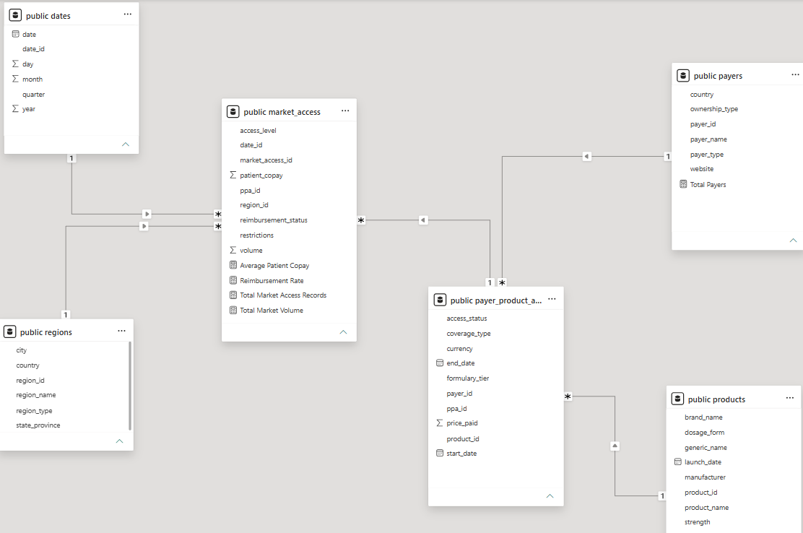
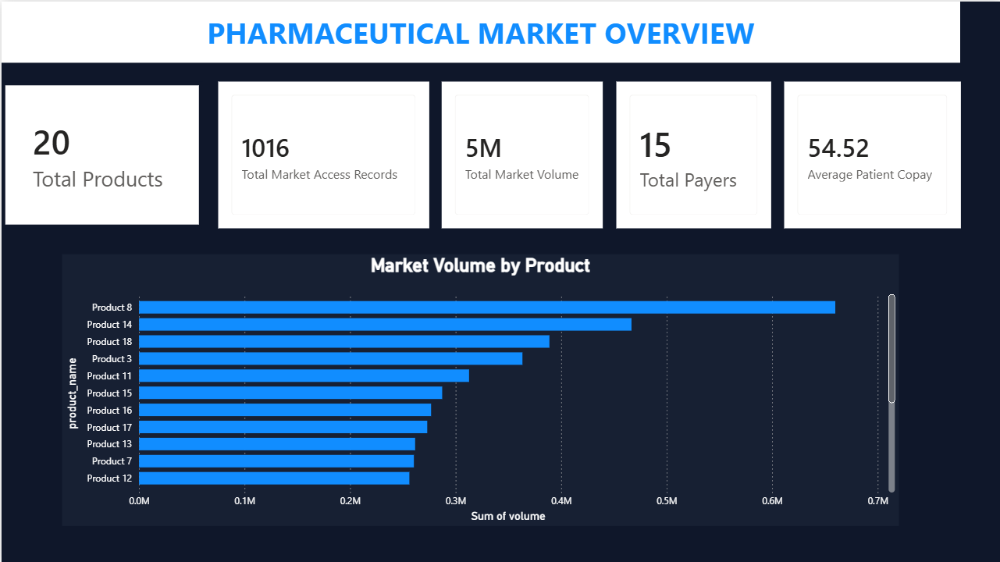
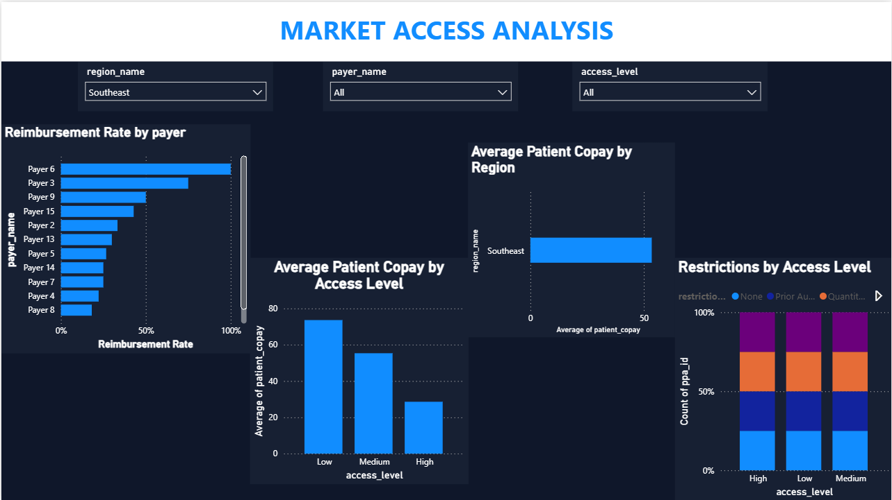

# Pharmaceutical Market Access Analytics

An end-to-end data analytics project analyzing pharmaceutical market access using synthetic healthcare data, PostgreSQL, SQL, Python, and Power BI.

## Project Overview

This project simulates a pharmaceutical market access analytics workflow.

The goal is to analyze how products perform across different payers and regions, and understand factors such as:

- Market access levels
- Patient copay
- Reimbursement rates
- Product access status
- Access restrictions
- Market volume
- Regional differences

The project follows an end-to-end analytics workflow:

**Synthetic Data Generation → Data Modeling → PostgreSQL → SQL Analysis → Power BI Dashboard → Business Insights**

## Dataset

The dataset is synthetically generated using Python and Pandas.

The project contains the following tables:

| Table | Description |
|---|---|
| `products` | Pharmaceutical product information |
| `payers` | Payer information |
| `payer_product_access` | Relationship between payers and products |
| `market_access` | Market access observations and metrics |
| `regions` | Geographic region information |
| `dates` | Date dimension for analysis |

The data is synthetic and created for educational and portfolio purposes.

## Data Model

The project uses a relational data model connecting products, payers, payer-product access relationships, market access records, regions, and dates.

### Entity Relationships

- `products → payer_product_access`
- `payers → payer_product_access`
- `payer_product_access → market_access`
- `regions → market_access`
- `dates → market_access`



## Python

Python was used to generate the synthetic dataset with Pandas and random data generation.

The generation script creates the tables and exports them as CSV files.

The random seed is fixed so that the same dataset can be reproduced when the script is executed again.

See:

`python/generate_data.py`

## SQL Analysis

PostgreSQL was used to store and analyze the generated data.

The SQL analysis includes:

- Average patient copay by access level
- Restriction distribution by access level
- Access-level distribution
- Reimbursement rate by payer
- Product access status by payer
- Average patient copay by payer
- Market volume by product
- Product ranking by market volume
- Regional and access-level analysis
- Market volume by access level

The SQL queries are organized in the `sql/` directory.

## Power BI Dashboard

Power BI was used to build interactive dashboards for analyzing pharmaceutical market access, reimbursement, patient copay, restrictions, and market volume.

### Pharmaceutical Market Overview

The overview dashboard provides high-level KPIs and product-level market volume analysis.



### Market Access Analysis

The market access dashboard analyzes reimbursement rates, patient copay, access levels, and restrictions across payers and regions.

Interactive slicers allow filtering by:

- Region
- Payer
- Access level




## Key Business Questions

The analysis focuses on questions such as:

1. How does patient copay vary across access levels?
2. Which payers have higher reimbursement rates?
3. What restrictions are most common at different access levels?
4. Which products have the highest market volume?
5. How does patient copay vary across regions?
6. How are product access statuses distributed across payers?

## Tools & Technologies

- Python
- Pandas
- PostgreSQL
- SQL
- Power BI
- GitHub

## Project Structure

```text
pharma-market-access-analytics/
│
├── data/
│   ├── dates (1).csv
│   ├── market_access (1).csv
│   ├── payer_product_access (1).csv
│   ├── payers (1).csv
│   ├── products (1).csv
│   └── regions (1).csv
│
├── python/
│   └── generate_data.py
│
├── screenshots/
│   ├── data_model.png
│   ├── market_access_analysis.png
│   └── pharmaceutical_market_overview.png
│
├── sql/
│   ├── 01_market_access_analysis.sql
│   ├── 02_payer_analysis.sql
│   ├── 03_product_analysis.sql
│   └── 04_business_insights.sql
│
├── pharma_market_access_dashboard.pbix
└── README.md
